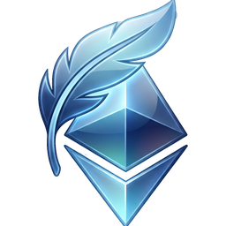
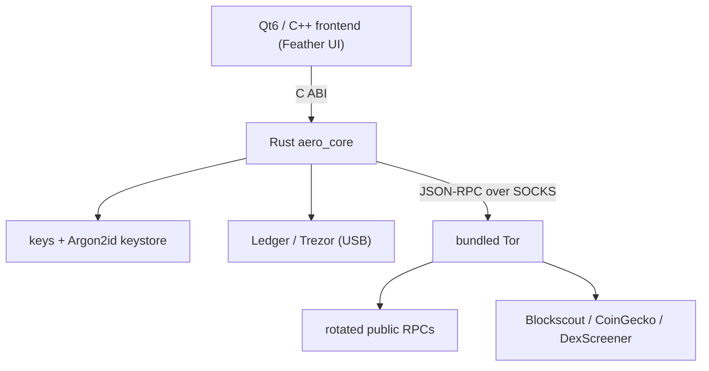

<p align="center">
  
</p>

<h1 align="center">Aero</h1>

<p align="center">
  <b>A free, lightweight, Tor-routed desktop wallet for Ethereum &amp; ERC-20 tokens.</b><br>
  The look and feel of <a href="https://featherwallet.org">Feather</a> - for Ethereum.
</p>

<p align="center">
  
  
  
  
  
</p>

---

Aero is a desktop Ethereum wallet that borrows Feather's clean, no-nonsense Qt interface and pairs
it with a small **Rust core** for keys, signing and networking. Everything routes through a
**bundled Tor** instance, keys are stored locally in an **encrypted file** (or kept on a
**hardware wallet**), and there is **no proprietary backend, no accounts, and no telemetry**.

> [!WARNING]
> **Alpha software, unaudited.** Aero has not had a third-party security review. Treat it as
> experimental, prefer small amounts, and keep an independent backup of your seed phrase. Use at
> your own risk.

## Features

- **Lightweight & private** - no bloat, no background sync services, no analytics. All RPC, price,
  history and image traffic goes over **Tor** (bundled `tor.exe`, no clearnet fallback).
- **Your keys, your coins** - BIP39 seed (12/24 words) with an optional **BIP39 passphrase**
  (Trezor-Suite-style). Wallet files are encrypted with **Argon2id + AES-256-GCM**.
- **Hardware wallets** - connect a **Ledger** or **Trezor**; the private keys never leave the
  device. The wallet won't open while the device is unplugged.
- **Multichain** - Ethereum, Arbitrum, Base, Optimism, Polygon, BNB Smart Chain, Gnosis and
  Avalanche, switchable from the status bar. Same address on every chain.
- **Full recovery** - restoring a seed scans **every common derivation scheme** (MetaMask/BIP44,
  Ledger Live, MEW/legacy, …) with a gap limit, so funds are found regardless of the wallet that
  created them (Electrum-style).
- **ERC-20 & NFTs** - token balances with logos, a searchable send picker, spam/address-poisoning
  filtering with a configurable dust threshold, and an optional NFT tab.
- **Send / receive** - EIP-1559 fees with Fast/Normal/Slow/Custom tiers (legacy gas on BSC), QR
  codes, a Feather-style transaction dialog, and desktop notifications for incoming/outgoing txs.
- **Home dashboard** - XMR/ETH tickers and a combined fiat balance, with selectable display
  currency and preferred block explorer.

## Supported networks

| Network | Native | History (keyless explorer) |
| --- | --- | --- |
| Ethereum | ETH | ✅ |
| Arbitrum One | ETH | ✅ |
| Base | ETH | ✅ |
| Optimism | ETH | ✅ |
| Polygon | POL | ✅ |
| Gnosis | XDAI | ✅ |
| BNB Smart Chain | BNB | send/receive only |
| Avalanche C-Chain | AVAX | send/receive only |

Balances, sends and prices work on every chain; transaction history is shown where a keyless
Blockscout-style explorer exists.

Every one of these services is free and public, which means any of them can rate-limit, break or
disappear. Aero keeps several RPC endpoints and several explorers per network, parks whichever one
stops answering and carries on with the next, so a provider having a bad day is not a wallet having
a bad day. If they all do, **Settings > Node** takes your own RPC endpoint and your own history API -
anything Etherscan-compatible, including an `api.etherscan.io/v2` URL with your own key, which covers
every network here and needs no new build.

## Privacy & trust model

- **Keys** never leave the machine (software wallets) or the device (hardware wallets). The
  keystore is encrypted with Argon2id (64 MiB / 3 passes) + AES-256-GCM.
- **Networking** is Tor-only. The Rust core refuses a remote RPC endpoint unless a SOCKS proxy is
  set (localhost/your-own-node is exempt), so a misconfiguration cannot leak your IP. Endpoints are
  rotated so no single server sees all of your queries.
- **Pricing** uses the on-chain Chainlink feed on mainnet (trustless) and CoinGecko over Tor
  elsewhere. **History** uses keyless Blockscout APIs over Tor.
- **No telemetry, no accounts, no update pings.** For zero metadata leakage, point Aero at your
  own node.

## Download & run (Windows)

Grab a release, unzip, and run `aero_gui.exe` from the portable folder. It bundles Qt, the Rust
core (`aero_core.dll`) and Tor (`tor/tor.exe`) - nothing to install.

```
dist/aero-portable/
  aero_gui.exe        the wallet
  aero_core.dll       Rust backend
  tor/tor.exe          bundled Tor (auto-started)
  Qt6*.dll, platforms/ Qt runtime
```

Wallet files (`*.aero`) are saved to your Documents folder by default.

## Building from source

### Backend (Rust core)

```sh
cd core
cargo build --release      # produces aero_core.dll + import lib
cargo test                 # unit + C-ABI integration tests
cargo run --example cli -- new 12   # try the core without the GUI
```

Regenerate the C header after changing the FFI:

```sh
cbindgen --config cbindgen.toml --output ../frontend/src/ethwallet/aero_core.h
```

> On Windows/MinGW, build with `RUSTFLAGS="-C link-args=-lwinpthread"`.

### Frontend (Qt6 GUI)

Requires **Qt 6**, **CMake ≥ 3.18** and a C++17 compiler (MinGW-w64 or MSVC).

```sh
cd frontend/gui
cmake -S . -B build -DCMAKE_BUILD_TYPE=Release
cmake --build build --config Release
```

The build links against the prebuilt `aero_core` (build the core first) and embeds the Feather
`.ui` layouts, stylesheet and app icons.

## Project layout

```
core/                 Rust `aero_core` crate (wallet backend)
  src/keys.rs         BIP39/BIP44 HD derivation (+ arbitrary paths, passphrase)
  src/keystore.rs     Argon2id + AES-256-GCM encrypted wallet file
  src/chains.rs       per-chain registry (native symbol, explorer, gas model)
  src/erc20.rs        ERC-20 ABI helpers
  src/provider.rs     Tor-routed JSON-RPC client with endpoint rotation
  src/hardware.rs     Ledger (alloy) + Trezor (host passphrase) device layer
  src/wallet.rs       balances, fees, EIP-1559/legacy sign+send, history, scan
  src/ffi.rs          C ABI consumed by the Qt frontend
frontend/
  gui/                Qt6 app: Feather .ui layouts, wizard, main window, models
  src/ethwallet/      C++ shim over the C ABI (Wallet, WalletManager, models)
tools/make_icons.py   regenerates the app icons from the logo
dist/                 portable, ready-to-run builds
```

## Architecture



The frontend never touches the network directly - the Rust core owns all I/O and enforces the
Tor-only policy.

## Roadmap / status

- [x] Rust core: keys, encrypted keystore, ERC-20, EIP-1559 + legacy signing
- [x] Tor-only provider with endpoint rotation
- [x] Full Qt6 GUI (wizard, home, send, receive, history, contacts, notes, settings)
- [x] Multichain (8 EVM networks)
- [x] BIP39 passphrase + multi-derivation-path recovery
- [x] Hardware wallets (Ledger / Trezor)
- [x] Watch-only wallets, message sign/verify, offline (air-gapped) signing, raw-tx broadcast
- [x] Speed-up / cancel pending transactions, pay-to-many, EIP-681 URIs, image QR scan
- [x] Light/dark theme, historical fiat value in history
- [ ] Third-party security audit (see `SECURITY.md`)
- [ ] macOS / Linux release builds (CI in `ci/build.yml` - move to `.github/workflows/` to enable)
- [ ] **Multisig (planned milestone)** - via Gnosis **Safe** smart accounts: connect/deploy a Safe,
  propose/confirm transactions, and collect co-signer signatures off-chain. This is a large,
  standalone feature (Safe contracts + off-chain signature aggregation) and is intentionally out of
  scope for the current single-sig releases.

## Disclaimer

Aero is an **independent, unofficial** project. It is **not affiliated with, endorsed by, or
connected to** Feather Wallet, the Monero Project, Electrum, or the Ethereum Foundation. It reuses
Feather's open-source (BSD-3-Clause) UI layouts and stylesheet under that license. "Ledger" and
"Trezor" are trademarks of their respective owners.

## Credits & license

- UI and stylesheet derived from **[Feather Wallet](https://github.com/feather-wallet/feather)**
  (BSD-3-Clause), itself derived from the **Monero Project** (BSD-3-Clause).
- Ethereum primitives, signing and hardware signers via **[alloy](https://github.com/alloy-rs)**.

Licensed under **BSD-3-Clause**. See [`LICENSE`](LICENSE) for the full text and attribution.
